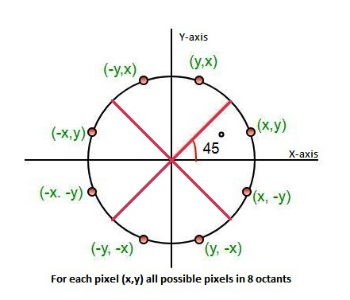

# Bresenham_circle_algorithm JAVA v1.0

**Implementado por: Erik Valdez Mondragón**

Facultad de Ingeniería, UNAM

Computación Gráfica e Interacción Humano-Computadora

## Instrucciones de instalación

Clonar este repositorio

	https://github.com/eriqmondu/Bresenham_circle_algorithm.git

Instalar Java 8 (OpenJDK) en Ubuntu 19.04

-Para realizar la instalación de Java en otros sistemas operativos ir a [Instalador de Java](https://www.java.com/es/download/).

Para instalar OpenJDK 8 en Ubuntu 19.04:
	
	apt-get update && apt-get upgrade
	apt-get install default-jdk

Navegar a la carpeta con el programa, compilar y ejecutar desde bash

	cd bresenham_circle_algorithm_java/
	javac bresenham_circle_algorithm_java.java
	java bresenham_circle_algorithm_java

Instrucciones:

Introducir las coordenadas del centro y el radio (mayor a 0)
(Sólo soporta números enteros)

	ALGORITMO DE BRESENHAM PARA DIBUJAR CIRCUNFERENCIAS
	Introduce las coordenadas del centro de la circunferencia
	X: 2
	Y: 1
	Radio: 8
	¡Finalizado!
	Los pixeles a dibujar, por arco, son los siguientes:
	Arco (X, Y)
	[10, 1]
	[10, 2]
	[10, 3]
	[9, 4]
	[9, 5]
	[8, 6]
	Arco (-X, Y)
	[-6, 1]
	[-6, 2]
	[-6, 3]
	[-5, 4]
	[-5, 5]
	[-4, 6]
	Arco (X, -Y)
	[10, 1]
	[10, 0]
	[10, -1]
	[9, -2]
	[9, -3]
	[8, -4]
	Arco (-X, -Y)
	[-6, 1]
	[-6, 0]
	[-6, -1]
	[-5, -2]
	[-5, -3]
	[-4, -4]
	Arco (Y, X)
	[2, 9]
	[3, 9]
	[4, 9]
	[5, 8]
	[6, 8]
	[7, 7]
	Arco (-Y, X)
	[2, 9]
	[1, 9]
	[0, 9]
	[-1, 8]
	[-2, 8]
	[-3, 7]
	Arco (Y, -X)
	[2, -7]
	[3, -7]
	[4, -7]
	[5, -6]
	[6, -6]
	[7, -5]
	Arco (-Y, -X)
	[2, -7]
	[1, -7]
	[0, -7]
	[-1, -6]
	[-2, -6]
	[-3, -5]
			
